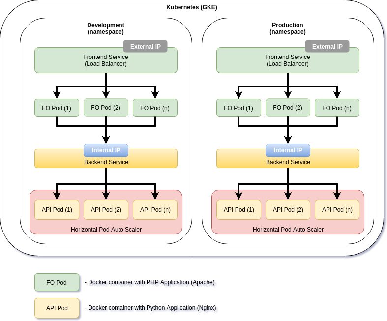

# Docker orchestration with Kubernetes on Google Cloud (GKE)
This project creates a REST API service and client.
* For the API backend was used an Python (Flask) REST API app on a Nginx and for the client frontend was used an PHP app running on Apache that sends an JSON by POST request to the backend API.



## Backend (API)
The backend REST API application code is on **api/** directory. In this directory is also the Dockerfile you can use to build the (Nginx+Python) Docker container where the API will run.

## Frontend
The Dockerfile that defines the image for the frontend container is found at **fo/** directory. The source code of this PHP application is on sub-directory **fo/src/**.

## Kubernetes 
The **Kubernetes** scrits and YAML object definition files are on **k8s/** directory.

### Script order
After clonning this git project to your Kubernetes Cluster you should follow this steps.

```
cd app-sample
./build+push-images.sh
cd k8s
./init.sh
./use_context_dev.sh # or use_context_prod.sh
./create_deployments.sh
./create_services.sh
```
> If you like to apply auto scale to the deployed Pods (backend API) use call auto-scale-api.sh script.
```
cd app-sample
./auto-scale-api.sh
```

## Running Demo
Test the response of the API accessing the Frontend public IP at: [35.195.3.76](http://35.195.3.76) (if is down, it should be because of running out of Google Cloud "credits")

